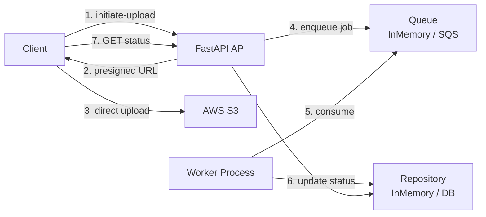

# Document Processing API

An event-driven FastAPI backend for secure, scalable document uploads and asynchronous processing. Built with **clean/hexagonal architecture**, demonstrating production-ready patterns: dependency injection, ports & adapters, domain-driven design, and real AWS integration.

## 🎯 Overview

Clients upload files **directly to AWS S3** using presigned URLs (zero server bandwidth), track document status through a lifecycle, and trigger background processing via a message queue. The architecture enables seamless swaps between in-memory implementations (for local dev) and real AWS services (S3, SQS) with a single environment variable toggle.

## 🏗️ Architecture

### High-Level Flow



### Clean Architecture Layers

```
app/
├── domain/           # Business logic & contracts
│   ├── models/       # Document, DocumentStatus
│   ├── ports/        # Interfaces (Repository, Storage, Queue)
│   └── errors/       # Domain exceptions
├── services/         # Use cases (DocumentService)
├── api/              # HTTP layer (routes, schemas, DI)
├── infrastructure/   # Adapters (S3, SQS, in-memory)
└── workers/          # Background job processor
```

**Key Principle**: Domain layer has **zero dependencies** on infrastructure. Business logic doesn't know about S3, SQS, or databases—only abstract ports.

## 📋 Features

- ✅ **Presigned S3 Uploads** - Direct client-to-S3 uploads (no server bandwidth)
- ✅ **Status Lifecycle Management** - Enforced state transitions (INITIATED → QUEUED → PROCESSING → COMPLETED/FAILED)
- ✅ **Event-Driven Processing** - Async job queue with separate worker process
- ✅ **Ports & Adapters** - Swap implementations without changing business logic
- ✅ **Dependency Injection** - FastAPI `Depends` with environment-based wiring
- ✅ **Input Validation** - Content-type whitelist, filename sanitization
- ✅ **Centralized Error Handling** - Domain exceptions → HTTP status codes
- ✅ **Real AWS Integration** - S3 presigned URLs, SQS message queue

## 🚀 Quick Start

### Prerequisites

- Python 3.10+
- (Optional) AWS account with S3 bucket and SQS queue

### Installation

```bash
pip install fastapi uvicorn boto3 pydantic
```

### Local Mode (In-Memory)

```bash
# Default mode - uses fake implementations
uvicorn app.main:app --reload
```

### AWS Mode (Real S3 & SQS)

```bash
export APP_ENV=aws
export S3_BUCKET_NAME="your-bucket-name"
export SQS_QUEUE_URL="https://sqs.us-east-1.amazonaws.com/123456789/your-queue"
export AWS_ACCESS_KEY_ID="your-key"
export AWS_SECRET_ACCESS_KEY="your-secret"
export AWS_REGION="us-east-1"  # optional, defaults to us-east-1

uvicorn app.main:app --reload
```

Open http://127.0.0.1:8000/docs for interactive API documentation.

## 📡 API Endpoints

### 1. Initiate Upload

Creates a document record and returns a presigned S3 upload URL.

```bash
curl -X POST http://127.0.0.1:8000/documents/initiate-upload \
  -H "Content-Type: application/json" \
  -d '{
    "filename": "resume.pdf",
    "content_type": "application/pdf"
  }'
```

**Response:**
```json
{
  "document_id": "7c3e7021-473e-4f8b-82e0-660b2d1d4dbd",
  "object_key": "documents/7c3e7021-473e-4f8b-82e0-660b2d1d4dbd/resume.pdf",
  "upload_url": "https://your-bucket.s3.amazonaws.com/...?X-Amz-Signature=..."
}
```

### 2. Upload to S3 (Client-Side)

Use the presigned URL to upload directly to S3:

```bash
curl -X PUT \
  -H "Content-Type: application/pdf" \
  --data-binary @resume.pdf \
  "PASTE_PRESIGNED_URL_HERE"
```

### 3. Enqueue Processing

Moves document to QUEUED status and sends job to queue.

```bash
curl -X POST http://127.0.0.1:8000/documents/{document_id}/enqueue
```

**Response:**
```json
{
  "job_id": "abc123-def456-..."
}
```

**Status Codes:**
- `200` - Successfully enqueued
- `404` - Document not found
- `409` - Invalid state transition (e.g., already QUEUED)

### 4. Get Document Status

Retrieves current document state and metadata.

```bash
curl http://127.0.0.1:8000/documents/{document_id}
```

**Response:**
```json
{
  "id": "7c3e7021-473e-4f8b-82e0-660b2d1d4dbd",
  "filename": "resume.pdf",
  "content_type": "application/pdf",
  "s3_key": "documents/.../resume.pdf",
  "status": "COMPLETED",
  "created_at": "2026-01-13T10:00:00Z",
  "updated_at": "2026-01-13T10:05:00Z",
  "last_error": null
}
```

## 🔄 Document Lifecycle

```
INITIATED → QUEUED → PROCESSING → COMPLETED
                              ↓
                           FAILED
```

**Status Transitions:**
- `INITIATED` → `QUEUED` (via `/enqueue`)
- `QUEUED` → `PROCESSING` (worker picks up job)
- `PROCESSING` → `COMPLETED` or `FAILED` (worker finishes)
- `COMPLETED` and `FAILED` are terminal states

## 👷 Running the Worker

### Local Mode (In-Memory Queue)

```bash
python -m app.workers.run_worker
```

The worker:
1. Dequeues jobs from the in-memory queue
2. Updates document status: QUEUED → PROCESSING → COMPLETED
3. Processes until queue is empty

### AWS Mode (SQS Queue)

*Coming in Stage 7 - Worker will poll SQS with long polling*

## 🎨 Design Decisions

### Why Presigned S3 Uploads?

- **Zero server bandwidth** - Files never touch the API server
- **Better scalability** - S3 handles the upload, not your server
- **Security** - Time-limited URLs, direct client-to-S3 connection
- **Cost efficiency** - No egress charges from your server

### Why Ports & Adapters?

The business logic (`DocumentService`) depends only on abstract interfaces:
- `DocumentsRepository` - Could be in-memory, SQLite, Postgres, MongoDB
- `StoragePort` - Could be in-memory, S3, Azure Blob, local filesystem
- `QueuePort` - Could be in-memory, SQS, RabbitMQ, Redis

**Result**: Swapped from in-memory to real S3 with **zero changes** to routes or service layer.

### Why Dependency Injection?

FastAPI's `Depends` + `@lru_cache` provides:
- **Testability** - Easy to inject mocks
- **Flexibility** - Toggle implementations via environment
- **Singleton pattern** - Shared instances across requests
- **Clean separation** - Infrastructure details stay in `deps.py`

### Why In-Memory First?

1. **Prove architecture** - Full end-to-end flow without cloud setup
2. **Faster iteration** - No AWS credentials/config needed
3. **Easier testing** - No external dependencies
4. **Interview-friendly** - Can demo locally without AWS account

### Why Separate Worker Process?

- **Non-blocking API** - `/enqueue` returns instantly
- **Independent scaling** - Scale workers separately from API
- **Fault isolation** - Worker crash doesn't affect API
- **Resource separation** - CPU-intensive processing doesn't slow API

## 🧪 Testing

*Stage 9 - Unit and integration tests coming soon*

## 📦 Project Structure

```
app/
├── api/
│   ├── routes/          # HTTP endpoints
│   ├── schemas/         # Pydantic request/response models
│   └── deps.py          # Dependency injection wiring
├── core/
│   └── settings.py      # Environment configuration
├── domain/
│   ├── models/          # Document domain model
│   ├── ports/           # Interface contracts
│   └── errors/          # Domain exceptions
├── infrastructure/
│   ├── aws/             # AWS client factory (S3, SQS)
│   ├── persistence/     # Repository implementations
│   ├── storage/         # Storage implementations (S3, in-memory)
│   └── queue/           # Queue implementations (SQS, in-memory)
├── services/
│   └── document_service.py  # Business logic
├── workers/
│   ├── run_worker.py    # Worker entry point
│   ├── processor_stub.py   # Job processing logic
│   └── job_message.py   # Message contract
└── main.py              # FastAPI app + exception handlers
```

## 🔮 Roadmap

- [x] Stage 1-5: Architecture, in-memory MVP, S3 presigned uploads
- [x] Stage 6: SQS queue adapter
- [ ] Stage 7: Worker consumes real SQS
- [ ] Stage 8: Persistent database (SQLite → Postgres)
- [ ] Stage 9: Unit and integration tests
- [ ] Stage 10: README polish, deployment notes

## 🛠️ Tech Stack

- **Framework**: FastAPI (Python)
- **AWS**: boto3 (S3, SQS)
- **Validation**: Pydantic
- **Architecture**: Clean/Hexagonal (Ports & Adapters)
- **Patterns**: Dependency Injection, Repository, Strategy

---

**Built with clean architecture principles to demonstrate production-ready backend patterns.**
