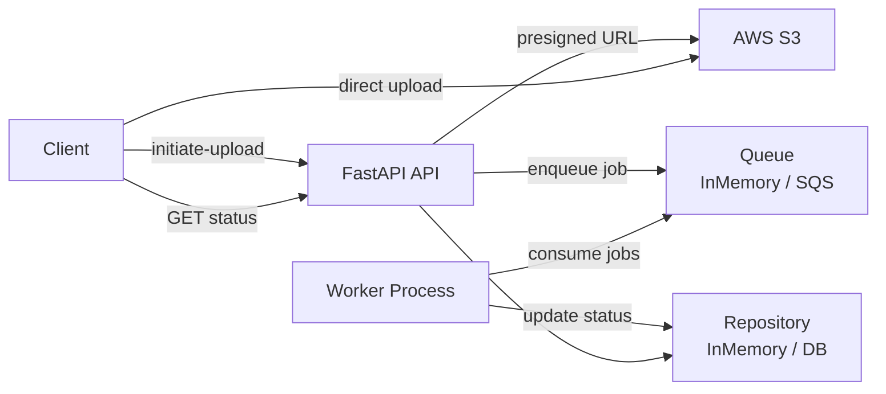

# Document Processing API

An event-driven FastAPI backend for secure, scalable document uploads and asynchronous processing.

Clients upload files **directly to AWS S3** using presigned URLs (no server bandwidth used), track document status, and trigger background processing via a queue. Built with clean/hexagonal architecture, dependency injection, and ports & adapters — enabling seamless swaps between in-memory and real AWS implementations.

## High-Level Architecture



## Request Flow (Live Demo)

### 1. Initiate Upload
```bash
curl -X POST http://127.0.0.1:8000/documents/initiate-upload \
  -H "Content-Type: application/json" \
  -d '{
    "filename": "my-resume.pdf",
    "content_type": "application/pdf"
  }'
```

**Response (APP_ENV=aws)**:
```json
{
  "document_id": "7c3e7021-473e-4f8b-82e0-660b2d1d4dbd",
  "object_key": "documents/7c3e7021-473e-4f8b-82e0-660b2d1d4dbd/my-resume.pdf",
  "upload_url": "https://your-bucket.s3.amazonaws.com/documents/7c3e7021-473e-4f8b-82e0-660b2d1d4dbd/my-resume.pdf?X-Amz-Signature=..."
}
```

### 2. Upload Directly to S3 (client-side)
```bash
curl -X PUT \
  -H "Content-Type: application/pdf" \
  --data-binary @my-resume.pdf \
  "PASTE_PRESIGNED_URL_HERE"
```

→ File lands in your S3 bucket instantly.

### 3. Enqueue Processing
```bash
curl -X POST http://127.0.0.1:8000/documents/{document_id}/enqueue
```

→ Returns job_id, status → **QUEUED**

### 4. Run Local Worker
```bash
python -m app.workers.run_worker
```

→ Status changes **QUEUED → PROCESSING → COMPLETED**

### 5. Check Status
```bash
curl http://127.0.0.1:8000/documents/{document_id}
```

→ Returns current status and metadata.

## Key Design Decisions

- **Presigned S3 Uploads**  
  Clients upload directly to S3 → server never handles file bytes. Saves bandwidth, improves scalability and security.

- **Ports & Adapters (Hexagonal Architecture)**  
  Business logic depends only on abstract ports. Swapped from in-memory to real S3 with **zero changes** to routes or service.

- **Dependency Injection**  
  FastAPI `Depends` + cached providers. Toggle local vs AWS with one env var (`APP_ENV`).

- **Async Queue + Separate Worker**  
  API returns instantly. Heavy work runs independently → better responsiveness, scaling, and fault isolation.

- **In-Memory First → AWS Later**  
  Full end-to-end flow proven locally before any cloud config. Reduced complexity and proved architecture correctness.

## Running the Project

### Local Mode (default — fake URLs)
```bash
uvicorn app.main:app --reload
```

### AWS Mode (real S3 presigned URLs)
```bash
export APP_ENV=aws
export S3_BUCKET_NAME="your-bucket-name"
export AWS_ACCESS_KEY_ID="..."
export AWS_SECRET_ACCESS_KEY="..."
export AWS_REGION="us-east-1"  # optional
uvicorn app.main:app --reload
```

Open http://127.0.0.1:8000/docs for interactive Swagger UI.

## Future Extensions (In-Progress)
- Real Amazon SQS queue + live worker
- Persistent database (SQLite → Postgres)
- Unit and integration tests
- Authentication & rate limiting

---
